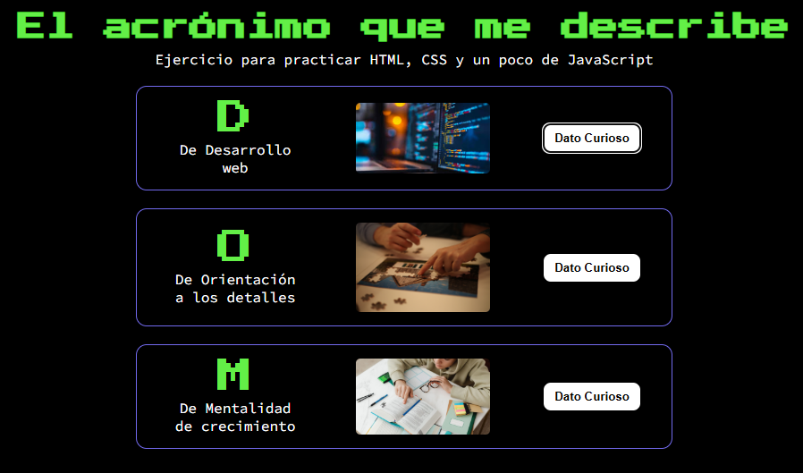
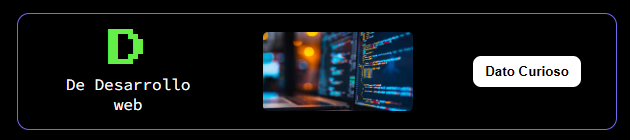
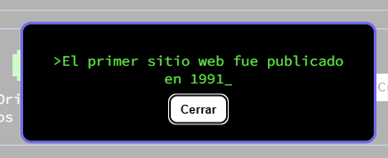

<h1 align="center">Acrónimo de tu nombre 🎮</h1>

## Descripción

Aplicación web sencilla en HTML, CSS y JavaScript que representa el acrónimo de tu nombre a través de tarjetas interactivas.
Cada letra del acrónimo tiene un significado acompañado de una imagen y un botón que permite desplegar un dato curioso mediante un modal accesible.

El proyecto sirve como práctica de estructura semántica en HTML, manejo del DOM con JavaScript, estilos con CSS variables, así como uso de eventos y modales nativos.

---

## Demostración

<p align="center">
  
</p>

---

## Cómo usar la app paso a paso

1. **Explorar las tarjetas del acrónimo**  
   - Cada sección muestra una letra del acrónimo junto con una breve descripción. 
   - Ejemplo: la D representa “Desarrollo web”.
   
     <p align="center">
       
     </p>
 
2. **Abrir un dato curioso**  
   - Haz clic en el botón **Dato Curioso** dentro de cualquier tarjeta..  
   - Se abrirá un modal mostrando un dato curioso relacionado con esa letra:

     <p align="center">
       
     </p>

3. **Cerrar el modal**  
   - Haz clic en el botón **Cerrar** dentro del modal.
   - Apretar tecla **Escape**.
---

## Tecnologías usadas

- HTML5 → Estructura semántica con section, main, header, etc.
- CSS3 → Uso de variables, tipografías personalizadas de Google Fonts y estilos responsivos.
- JavaScript → Manipulación del DOM, eventos de clic, despliegue dinámico del modal.

---

## Mejoras por implementar

- Incluir más letras al acrónimo o permitir que sea personalizable por el usuario.
- Agregar animaciones suaves al abrir y cerrar el modal.
- Hacerlo responsivo.

---

## Estado del proyecto

- Proyecto funcional ✅  
- Con potencial de ampliación para hacerlo más dinámico e interactivo.

---
## Dev 👩‍💻👨‍💻

Si quieres ejecutar o modificar el proyecto en tu entorno local:  

1. Clona el repositorio:  
   ```bash
   git clone https://github.com/tu-usuario/acronimo-dom.git```
2. Accede al directorio:
   ```cd acronimo-dom```
3. Abre el archivo index.html en tu navegador preferido (no requiere servidor adicional).
4. Para cambios en estilos, edita el archivo:
  ```acronimo.css```
5. Para cambios en la interactividad, edita:
  ```script.js```
6. Si deseas añadir más letras al acrónimo, agrega una nueva sección <section class="tarjeta"> en el index.html y actualiza el objeto datosCuriosos en script.js.
